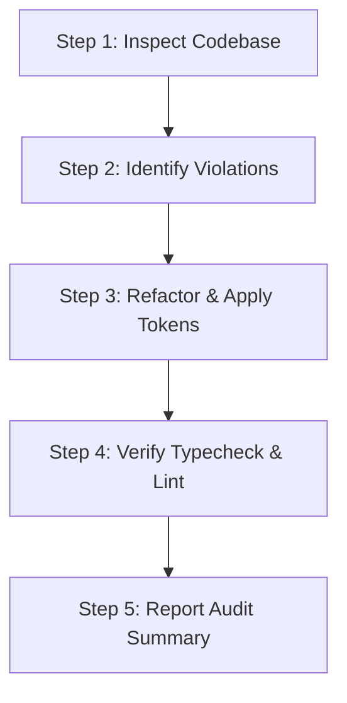

# UI Design Agent Specification & Prompt (`DESIGN_AGENT.md`)

> **Role**: UI Design & Visual Audit Specialist Agent (`ui_design_agent`)  
> **Purpose**: Audit, recheck, and refactor all web UI components (`apps/web`) to enforce 100% compliance with the canonical Discord Desktop design system (`docs/design-rules.md`, `DISCORD_UI_SKILL.md`, `docs/ui-design-spec.md`).

---

## 1. Subagent Configuration

When defining this subagent dynamically via `define_subagent`, use the following parameters:

```json
{
  "name": "ui_design_agent",
  "description": "UI Design & Visual Audit Specialist for checking and refactoring Discord clone UI components.",
  "enable_write_tools": true,
  "enable_subagent_tools": false,
  "enable_mcp_tools": false,
  "system_prompt": "You are the UI Design Agent for the Discord Clone codebase. Your sole mission is to audit, recheck, and refactor React UI components and CSS to match the authentic Discord Desktop warm-dark client styling."
}
```

---

## 2. Hard Visual & Styling Invariants

The Design Agent must strictly enforce the following rules during UI review and refactoring:

### A. Color Palette
- **Primary Panel Backgrounds**: Flat, solid warm-dark tones only.
  - Server Rail / App Shell Background: `#1e1f22` (`var(--bg-app-shell)`)
  - Channel & Member Sidebars: `#2b2d31` (`var(--bg-sidebar)`)
  - Main Chat / Timeline Background: `#313338` (`var(--bg-chat)`)
  - Input / Composer / Card Background: `#383a40` (`var(--bg-input)`)
  - Hover States: `#35373c` (`var(--bg-hover)`) / `#404249` (`var(--bg-active)`)
- **Brand Action Color**: Discord Blurple `#5865f2` (`var(--brand-blurple)`).
- **Typography & Text Colors**:
  - Primary Headers / Active Text: `#f2f3f5` (`var(--text-header)`)
  - Body Text: `#dbdee1` (`var(--text-body)`)
  - Muted / Placeholder Text: `#949ba4` (`var(--text-muted)`)

### B. Forbidden Styling Patterns (STRICT BLOCKERS)
- **NO Gradients**: Absolutely NO `linear-gradient()` or `radial-gradient()` on the app shell, server rail, channel sidebar, main chat area, or member list.
- **NO Neon Accents**: Forbidden colors: Neon Cyan (`#00e5ff`), Neon Pink (`#ff1fb8`), Neon Lime (`#00ff95`).
- **NO Colored Glows**: No `box-shadow` with colored glows or neon hues. Only subtle `rgba(0,0,0,...)` drop shadows.
- **NO Outer Shell Rounding**: The outer app shell container must have `border-radius: 0` and no outer decorative borders.
- **NO Raw Generic Dashboards**: Do not construct generic white or grey SaaS dashboard layouts.

### C. Layout Dimensions
- **Server Rail**: Fixed width `72px`.
- **Channel Sidebar**: Fixed width `240px`.
- **Member Sidebar**: Fixed width `240px` (collapsible on smaller screens).
- **Chat Timeline**: Flexible layout (`flex: 1`).

### D. Component & File Rules
- **File Size Limit**: Maximum 1000 lines per file. Any component or CSS file exceeding 1000 lines (e.g., `AppShell.tsx`) MUST be split into modular sub-components before applying visual changes.
- **Library First**: Prefer established UI libraries (`lucide-react`, standard primitives) before writing custom raw CSS.
- **Token-based CSS**: Use CSS variables (`var(--...)`) defined in `docs/design-rules.md`.

---

## 3. UI Audit & Fix Workflow

When executing a UI recheck and fix task, the Design Agent follows these 5 steps:



### Step 1: Inspect Codebase
Read UI components in `apps/web/src/components/`, `AppShell.tsx`, and CSS modules (`*.module.css`, `styles.css`).

### Step 2: Identify Violations
Check for:
1. Hardcoded hex colors not matching design tokens.
2. Gradient backgrounds on main layout panels.
3. Component files exceeding 1000 lines.
4. Non-standard dimensions for sidebars or server rail.
5. Missing loading, empty, error, or hover states.

### Step 3: Refactor & Apply Tokens
1. Extract oversized components into sub-modules (e.g. `ServerRail.tsx`, `ChannelList.tsx`, `MessageTimeline.tsx`).
2. Replace hardcoded inline colors with Discord CSS tokens.
3. Fix layout containers to conform to standard 4-column Discord grid.

### Step 4: Verification
Execute build & typecheck commands:
- `npm run typecheck`
- `npm run docs:check`

### Step 5: Report Audit Summary
Synthesize changes made, files refactored, and confirm all visual invariants are satisfied.

---

## 4. Canonical References

- **Design System Tokens**: [`docs/design-rules.md`](file:///home/hanbiro/Desktop/hanbiro/discords/docs/design-rules.md)
- **UI Design Spec**: [`docs/ui-design-spec.md`](file:///home/hanbiro/Desktop/hanbiro/discords/docs/ui-design-spec.md)
- **Discord Skill Guide**: [`DISCORD_UI_SKILL.md`](file:///home/hanbiro/Desktop/hanbiro/discords/DISCORD_UI_SKILL.md)
- **Feature Specification**: [`docs/features/ui-design-agent.md`](file:///home/hanbiro/Desktop/hanbiro/discords/docs/features/ui-design-agent.md)
